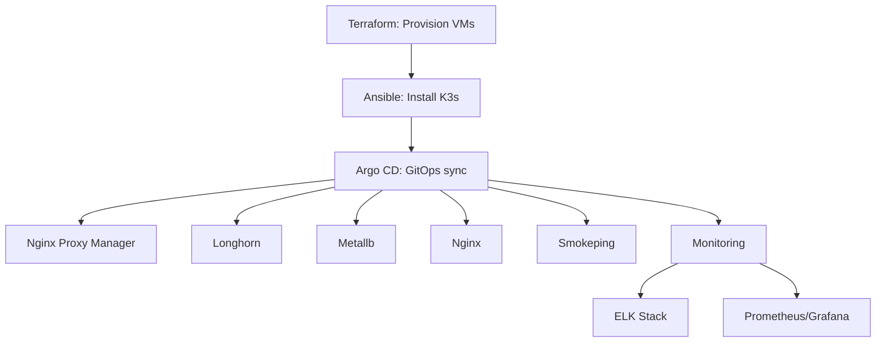

# 🏡 homelab-infra

Infrastructure-as-Code for my personal home lab environment — built using **Terraform**, **Ansible**, **Kubernetes (K3s)**, and managed with **Argo CD** via GitOps. This project is to document skills and technologies learned and to share example code used on a private repo to provision and manage my homelab.


[](https://github.com/paul-sturrock/homelab-infra/releases)


---

## 🔧 Infrastructure

This homelab runs on a pair of dedicated servers using Proxmox VE as the base hypervisor, hosting Kubernetes (K3s) nodes as virtual machines.

More about the physical setup in [docs/hardware/README.md](docs/hardware/README.md)

---

## 🧰 Tools & Technologies

- 🖥️ **Proxmox VE** – Bare-metal hypervisor for VM orchestration
- 🛠️ **Terraform** – Provisioning and VM lifecycle management
- ⚙️ **Ansible** – Automated configuration and post-deploy tasks
- ☸️ **K3s** – Lightweight Kubernetes for edge/home lab clusters
- 🚀 **Argo CD** – GitOps deployment and continuous delivery
- 💾 **Longhorn** – Distributed block storage for Kubernetes
- 🔍 **Monitoring** - Metric and log monitoring

---

## 📦 Repo Structure
```text
homelab-infra/
├── terraform/           # Proxmox VM definitions
├── ansible/             # Server provisioning and role automation
├── kubernetes/
│   ├── apps/            # Self-hosted apps (Nginx Proxy Manager, longhorn, metallb, nginx, smokeping etc)
│   ├── monitoring/      # ELK stack with filebeat and Prometheus/Grafana
│   └── argo/            # GitOps definitions
│── projects             # Smaller home lab projects to gain further skills
│   └── various side projects/
├── docs/                # Architecture diagrams and screenshots
├── .env.example         # Environment variable samples
└── README.md            # This file
```

## ⚙️ How It Works

1. **Terraform** provisions Proxmox VMs
2. **Ansible** connects to VMs and installs K3s
3. **Argo CD** syncs Kubernetes apps from GitHub via GitOps
4. **Apps & tools** like Nginx Proxy Manager, Longhorn, and metrics dashboards are deployed declaratively

---

## ⚙️ Automation Pipeline



---

## 🛣️ Roadmap (Planned Features)

- [ ] 🔄 Integrate GitHub Actions for CI (linting Terraform, Ansible, K8s)
- [ ] 🧪 Add automated tests for Terraform plans and manifest validation
- [ ] 🌐 Add private mesh VPN (Tailscale or WireGuard) for secure remote access
- [X] 📈 Deploy observability stack (Prometheus, Grafana, ELK stack)
- [ ] 🔐 Integrate secrets management (SOPS + Age, or SealedSecrets)
- [ ] 📦 Package apps as Helm charts and track via Argo CD


