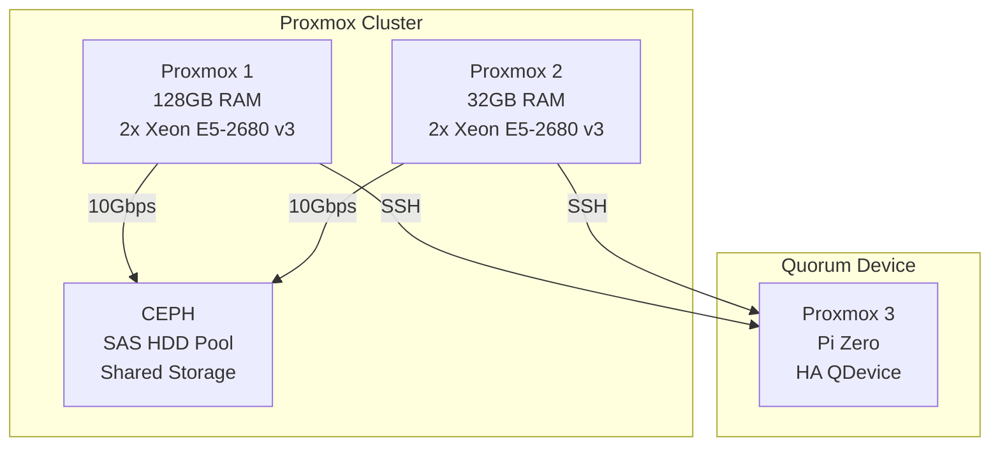

# 🖥️ Home Lab Hardware Overview

This homelab runs on two physical servers using **Proxmox VE** for virtualization, hosting virtual machines that form the K3s Kubernetes cluster. CEPH is used as the main distributed storage backend, providing high availability and redundancy.

---

## 🧱 Server Hardware

| Node       | Hostname         | Server   | CPU                 | RAM         | Storage       | Notes              |
|------------|------------------|----------|---------------------|-------------|---------------|--------------------|
| Proxmox 1  | proxmox-1        | Dell R730| 2× Xeon E5-2680 v3  | 128 GB      | CEPH (shared) | Main  + K3s master |
| Proxmox 2  | proxmox-2        | Dell R730| 2× Xeon E5-2680 v3  | 32 GB       | CEPH (shared) | Auxiliary workloads|

---

## 📦 Storage

- **Primary Pool**: [CEPH](https://ceph.io/) replicated storage
- **Disks**: SAS HDDs in both nodes (no SSDs currently)
- **Purpose**: High availability, redundancy, and distributed storage for K3s persistent volumes
- **Integration**: Exposed to Kubernetes via **Longhorn**

---

## 🌐 Networking

- **LAN Subnet**: `192.168.1.0/24`
- **MetalLB Range**: `192.168.1.180 - 192.168.1.190`

---

## 🧰 Virtualization Platform

- **Hypervisor**: Proxmox VE
- **VMs**: Used for K3s nodes, PBS, Home Assisstant (HAOS)
- **Backups**: Proxmox Backup Server (PBS)

---

## 🖧 Proxmox High Availability Diagram

---

## 📝 Notes

- CEPH offers great flexibility for future scaling (adding nodes/disks)
- The cluster is currently homelab-focused but follows production-grade practices
