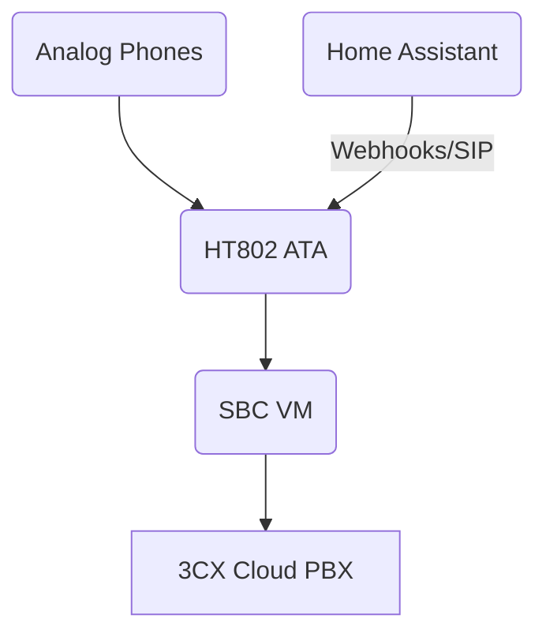

# ☎️ 3CX Cloud PBX and SBC Deployment

This mini-project documents the deployment of a 3CX Cloud PBX system with a self-hosted SBC (Session Border Controller) VM and Grandstream HT802 ATA devices connecting analogue phones.

---

## 🛠 Components

- **3CX Cloud PBX** (self-hosted or free-tier cloud instance)
- **SBC VM** (Debian 11, deployed via Proxmox VM)
- **Grandstream HT802 ATA** (Analogue phone adapters)
- **Home Assistant** (Optional integration for phone-based automation)

---

## 🌐 Architecture

## 🛣️ Planned Features
	•	💻 Migrate from cloud-hosted 3CX to a fully self-hosted 3CX PBX instance
	•	🧠 Deepen Home Assistant integration (e.g. SIP-based triggers, call events)
	•	📈 Monitor PBX VM with Prometheus node exporter + Grafana
